<div dir="rtl">

فصل ۴ کتاب هریس، جلسه اول، قسمت ۴.۱ تا ۴.۳

 طراحی سیستم‌های دیجیتالی با SystemVerilog

به صورت combinatitional


# ۴.۰−مقدمه


### FPGA

مخففِ field programmeble gate array، دستگاهی است که از تعدادی بلوک منطقی تشکیل شده و با استفاده از میدان مغناطیسی قابل برنامه ریزی است. برای مثال می‌توان چندین بلوک منطقی از آن را طوری برنامه ریزی کرد که به عنوان multiplexer عمل کنند. همچنین تعدادی پایه دارد که به کمک آن‌ها با ورودی/خروجی در ارتباط است. (IO pins)


## ابزارهای CAD

 نرم افزارهایی هستند که طراحیِ  چیز های مختلف به کمک کامپیوتر.CAD مخفف computer aided design یا طراحی به کمک کامپیوتر است. در معماری کامپیوتر، ما سخت افزارها را با کمک کامپیوتر طراحی می‌کنیم. این طراحی چندین مرحله دارد.


#### مرحله اول: طراحی ساختار مدار

  ساختار مدار را می‌توان به ۲ شکل طراحی کرد (یا توصیف کرد).


 **روش اول** به کمک رسم شماتیک است. در این روش مانند شکل زیر ( و مانند آن چه روی کاغذ رسم میکردیم) مدار ها را رسم میکنیم.

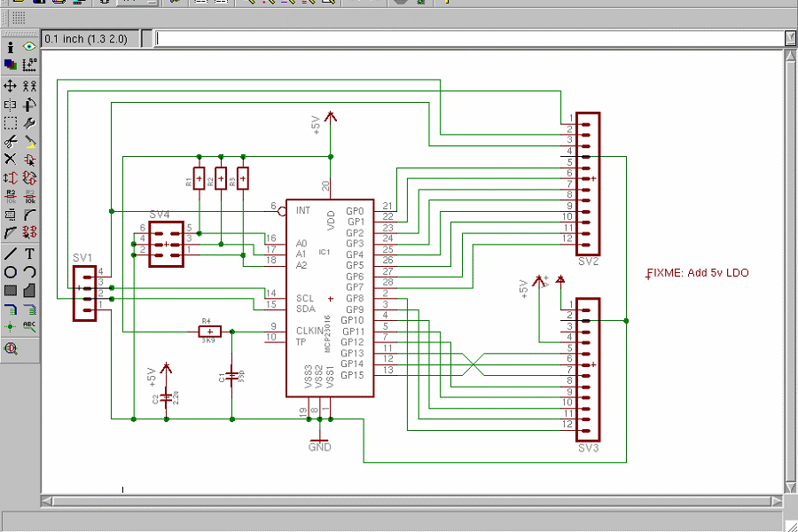 


**روش دوم** طراحی به کمک زبان‌های توصیف سخت افزار (‍HDLها) روشی است که در این درس بررسی میکنیم. در این روش با زبانی مشابه زبان‌های برنامه نویسی، سخت افزار را توصیف میکنیم، سپس سنتز می‌شود و ..


مراحل بعد از طراحی به ترتیب عبارت است از سنتز، شبیه‌سازیِ functional، طراحی فیزیکی، شبیه سازی timing، کانفیگ کردن چیپ.


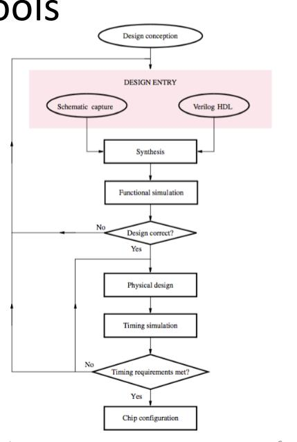 


# ۴.۱-معرفی زبان‌های توصیف سخت افزار(HDLها)

به کمک این زبان‌ها، کارکردِ منطقیِ مدار را توصیف میکنیم. ابزارهای CAD برای ما از روی توصیفمان، gateهای منطقی را در سر جای خود می‌چینند.

بدون کمک این ابزارها، طراح می‌بایست به صورت دستی اقدام به ساده کردن مدار با جدول درستی و محاسباتی بولی می‌کرد ولی این کار بسیار سخت و پر خطایی است. برای همین  در دهه ۱۹۹۰ اقدام به طراحی ابزارهایی کردند که این ساده سازی را به صورت خودکار انجام دهد و به طراح اجازه دهد در سطح abstraction بالاتری طراحی‌هایش را انجام دهد. در این صورت آن ها تنها کاراییِ منطقی مدار را طراحی می‌کردند و ابزار CAD گیت‌های بهینه شده را تحویل می‌داد. امروزه اکثر کارهای تجاری به کمک HDLها صورت می‌گیرد.

دو ابزار معروف برای این طراحی‌ها، SystemVerilog و VHDL هستند. دو ابزار با هدف یکسان ولی سینتکس متفاوت.


### شبیه‌سازی (simulation)

شبیه‌سازی ما در مرحله اول باگ خواهد داشت و این باگ‌ها باید رفع شوند. 

اینکه پس از ساخته شدن مدار بخواهیم ان را دیباگ کنیم بسیار زمان‌بر و گران خواهد بود چرا که وقتی مدار ساخته شود، ما تنها به سیگنال ها و پین‌های خروجی دسترسی داریم و درکی از آن‌چه داخل چیپ اتفاق می افتد نداریم.

در شبیه سازی ورودی‌ها به [توصیفِ] مدار داده می‌شوند و صحتِ خروجی‌ها چک می‌شود.

پیدا کردنِ ارورها و باگ‌ها در شبیه‌سازی به جای سخت افزار، میلیون‌ها دلار صرفه جویی کرده است.


شبیه‌سازی، مشابه تصویر بالا، ورودی‌هایی در طی زمان به سیگنال های ورودی داده می‌شود و طراح خروجی ها و سیگنال‌های میانی را بررسی می‌کند.


### سنتز (synthesis)

پس از اطمینان از طراحیِ صحیح مدار و عملکرد صحیح، فاز سنتز را انجام می‌دهیم. یعنی ابزار سنتز توصیف‌های ما را به مجموعه‌ای از گیت‌ها و سیم‌های متصل‌کننده تبدیل می‌کند. (netlist)

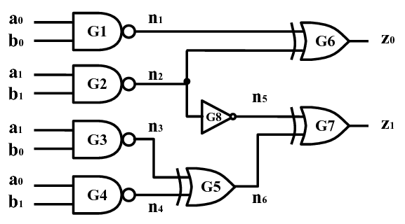


ابزار سنتز تلاش می‌کند مساحتِ چیپ را کم کند و همچنین سرعت آن را بالا ببرد. می‌توان در تنظمیاتِ ابزار، این اولویت‌ها را تعیین نمود. 

خروجی netlist می‌تواند یک فایل متنی باشد یا به صورت شماتیک رسم شده باشد.


### زیرمجموعه قابل سنتز

 توجه: همه دستوراتِ داخل زبان‌های توصیف سخت افزار، قابل سنتز نیستند

اگرچه هدف اولیه ما، ساخت زبانی برای توصیف سخت افزار بود اما بسیاری از دستورات قابل سنتز نیستند، به زیرمجموعه‌ی قابل سنتز از دستورات، synthesizable subset گفته می‌شود.

معمولا کد سخت‌افزاری در ۲ بخش توصیف می‌شود. 

+ بخش اول، ماژول اصلی که تمامی کدهای آن، قابل سنتز هست. این بخش خود سخت افزار را توصیف می‌کند.
+ بخش دوم، تست بنج (test bench) بخش‌هایی که قابل سنتز نیستند و کارشان اِعمال ورودی‌ها به ماژول اصلی و بررسی خروجی‌هاست. همچنین ممکن است اطلاعاتی از تفاوت در خروجی مورد انتظار و خروجیِ حاضرِ مدار چاپ کند. (print)


### انواع توصیف در HDLها

ماژول‌ها (همان مدارها یا چیپ‌ها)یی که توسط SystemVerilog طراحی می‌شوند، انواع زیر را دارند:

+ ساختاری (structural) در این شیوه طراح توصیف می‌کند **چگونه یک ماژول از ماژول‌های کوچک‌تر (و پایه) ساخته می‌شود**. در این شیوه ابزار HDL خیلی کاری برای بهینه سازی انجام نمی‌دهد.
+ رفتاری (behavioral) این شیوه سطح بالاتر است و طراح **رفتار و عملکردِ مدار** را توصیف می‌کند. در این شیوه بهینه‌سازی و تبدیل به gate‌ها برای ابزار HDL کار پیچیده‌تر و زمان‌بر تری است ولی در عوض امکان بهینه‌سازی بیشتری فراهم است و ممکن است کد بهینه‌تری در نهایت تولید شود.
+ مدل‌های دیگری مثل transistor level هم هستند ولی به دلیل عدم امکان سنتز، بیشتر برای آموزش مناسب هستند و در اینجا بررسیشان نمی‌کنیم.


نمونه‌ای از کدِ رفتاری

```verilog
module example(input logic a, b, c,
		output logic y);
	assign y = ~a & ~b & ~c | a & ~b & ~c | a & ~b & c;
endmodule
```


عبارت های module و endmodule نشان دهنده‌ی شروع و پایان ماژول هستند. اسم این ماژول example است و از اپراتور های not and or استفاده شده.


این ماژول به شکل زیر شبیه‌سازی می‌شود:


و نتیجه‌ی سنتزِ آن چیزی شبیه به شکل زیر است:

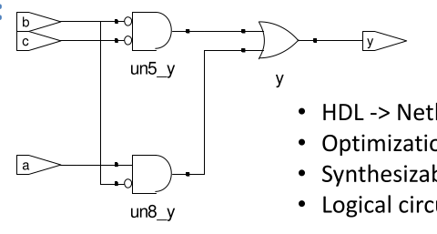


#### زبان توصیف سخت‌افزار، زبان برنامه‌نویسی نیست!

باید دقت داشت که برخلاف زبان برنامه‌نویسی، در سخت‌افزار، همه چیز همزمان (parallel) اجرا می‌شود.

در توصیف سخت افزاری، از موارد زیر باید پرهیز شود:

+ فکر کردن مثل برنامه نویسی
+ متغیرهای زیاد
+ حلقه (لوپ) های زیاد

در صورتی که به زبانِ توصیف سخت‌افزار به چشم زبان برنامه نویسی نگاه کنیم، ممکن است اتفاقات زیر بیفتد:

+ اگر ندانیم چه سخت افزاری سنتز خواهد شد، احتمالا نتیجه مورد قبولی دریافت نخواهیم کرد.
+ ممکن است سخت افزار بسیار بیشتری از چیزی که واقعا لازم است تولید شود.
+ ممکن است مداری توصیف شود که در شبیه‌سازی درست عمل می‌کند ولی قابل سنتز نیست.

برای اینکه طراحی درستی داشته باشید، به سیستم به چشم مجموعه‌ای از بلوک‌های combinational، رجیسترها و ماشین‌های finite state نگاه کنید. این‌ها را قبل از دست به کد شدن، روی کاغذ رسم کنید.

پس برای استفاده از HDLها، پیش ازمدارهای هرچیزی **به سخت‌افزاری که قرار است تولید کند فکر کنید**.


### برخی نکات سینتکسی در SystemVerilog

+ حساس به بزرگ و کوچک بودن مثلا reset و Reset متفاوت هستند.
+ اسامی با رقم شروع نمی شوند مثلا 2mux اسم درستی نیست.
+ فضای خالی‌(فاصله و tab و اینتر و غیره) ایگنور می‌شود.
+ کامنت‌ها مشابه سینتکس سی/جاوا با `/*  */`  و  `//` هستند.


# ۴.۲ مدارهای combinational


همانطور که می‌دانید هدف ما طراحی مدارهای ترتیبی است که سنکرون با کلاک کار می‌کنند. این مدارها از ۲ قسمتِ ترکیبی (combinational) و رجیسترها تشکیل می‌شوند. در این قسمت طراحی مدارهای ترکیبی را یاد می‌گیریم.

خروجی در مدارهای ترکیبی فقط و فقط از ورودی آن‌ها در همان لحظه ساخته می‌شود.


### عملگرهای بیتی (bitwise)

عملگرهای بیتی می‌توانند روی تک بیت یا روی busِ چند بیتی عمل کنند. مثلا ماژول inv یک not برای باس ۴ بیتی است.

 ```verilog
module inv(input logic [3:0] a,
		output logic [3:0] y); 
	assign y = ~a;
endmodule
 ```


دقت کنید که `a[3:0]` نشان‌دهنده‌ی یک باس ۴ بیتی است که به صورت little endian قرار گرفته. یعنی بیت پرارزش (MSB) در سمت چپ قرار گرفته و بیت کم ارزش (LSB) در سمت راست. 

اگر برعکس این بود مثلا a[0:3] آن موقع  big endian بود و بیت پرارزش در سمت راست قرار می‌گرفت و بیت کم ارزش در سمت چپ.


به این تفاوت endianness گفته می‌شود که کاملا اختیاری است. این مورد فقط برای عملگرهایی مثل جمع اهمیت دارد و در مثال ما برای not کردن اهمیت ندارد.

تا زمانی که یک شیوه ثابت را دنبال کنیم و آن را تغییر ندهیم مشکلی وجود ندارد مثلا ما در سراسر کتاب از شیوه little endian استفاده میکنیم که برای n bit به صورت `[N − 1:0]` است.


یک مثال کامل‌تر

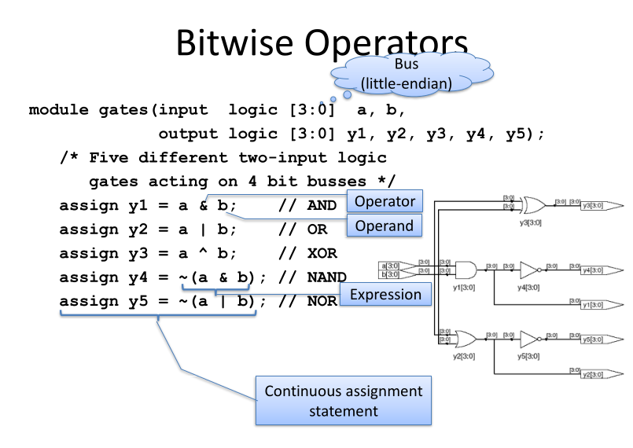


### عملگرهای کاهشی

ممکن است بخواهیم یک عملیات را روی همه بیت‌های یک باس انجام دهیم تا به تنها یک بیت برسیم. مثلا همه بیت‌های باس را با هم and کنیم. اینکار با سینتکس زیر امکان‌پذیر است:


```verilog
module and8(input logic [7:0] a,
		output logic  y);
	assign y = &a;
	// &a is much easier to write than
	// assign y = a[7] & a[6] & a[5] & a[4] &
	//            a[3] & a[2] & a[1] & a[0];
endmodule
```


### انتساب شرطی (عملگر ۳عملوندی)

این عملگر بر اساس ورودیِ condition، از بین ۲ ورودی خود، یکی را انتخاب می‌کند. دقیقا یک mux دو به یک.

```verilog
module mux2(input logic [3:0] d0, d1,
		input logic 	  s,
		output logic [3:0] y);
	assign y = s ? d1 : d0;
endmodule
```

در صورتی که ورودی s برابر یک باشد، ورودی d1 را به حروجی assign می‌کند و در غیر این صورت ورودی d0 را.


برای ساخت mux های بزرگتر (مثلا ۴ به ۱) می‌توان چندین عملگر ۳ عملوندی را ترکیب کرد. مثلا:

```verilog
assign y = s[1] ? (s[0] ? d3 : d2)
				: (s[0] ? d1 : d0);
```


### متغیرهای داخلی (input variables)

گاهی لازم است فرمول‌های پیچیده را برای پیاده‌سازی به قسمت‌های کوچک‌تری بشکنیم.

با استفاده از کلیدواژه logic می‌توانیم متغیر داخلی تعریف کنیم. اینها سیگنال هایی هستند که نه از ورودی گرفته می شوند و نه به خروجی داده می‌شوند. درست مثل متغیرهای محلی در زبان‌های برنامه‌نویسی.


نکته خیلی مهم اینکه عملگر assign برخلاف = در زبان‌های برنامه نویسی مرسوم، به صورت همزمان و concurrent کار می‌کند و اینطوری نیست که اول، خطِ اول را اجرا کند و بعد خطِ دوم.

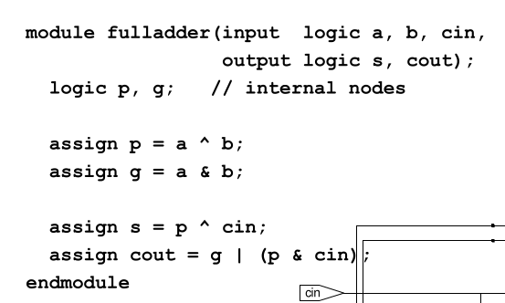


برای مثال در این ماژول، ترتیب declare کردن‌ها اهمیت ندارد چون همه همزمان اتفاق می‌افتد.


چون خیلی مهمه متن اصلیش از کتاب رو هم میارم شاید با اون بهتر بشه فهمید:

```
HDL assignment statements ( assign in SystemVerilog and <= in
VHDL) take place concurrently. This is different from conventional pro-
gramming languages such as C or Java, in which statements are evaluated
in the order in which they are written. In a conventional language, it is important that S = P ⊕ C in comes after P = A ⊕ B, because statements are executed sequentially. In an HDL, the order does not matter. Like hard-
ware, HDL assignment statements are evaluated any time the inputs, sig-
nals on the right hand side, change their value, regardless of the order in which the assignment statements appear in a module.
```


### تقدم عملگرها (precedence)

مانند زبان‌های برنامه نویسی باید حواسمان به تقدم عملگر ها باشد و در جای لازم از پرانتز استفاده کنیم. در اکثر موارد سیستم‌وریلاگ مشابه زبان‌های برنامه نویسی است و نیازی به نگرانی نیست :)

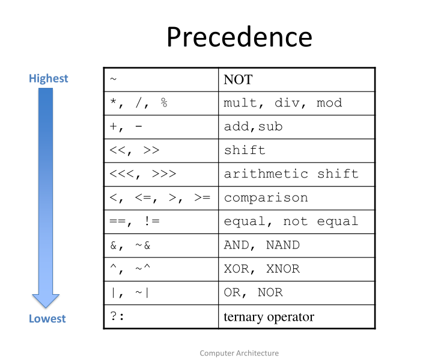


### اعداد

برای نوشتن اعداد (ثابت‌ها) در وریلاگ به شیوه زیر عمل می‌کنیم: 

```verilog
N'Bvalue
3'b101
```

که می‌شود ۳ بیت به صورت باینری که آن ۳ بیت ۱۰۱ هستند (۵)

البته می‌توان N'B را نگذاشت و به صورت دیفالت decimal می‌شود ولی توصیه می‌شود که بگذاریم.


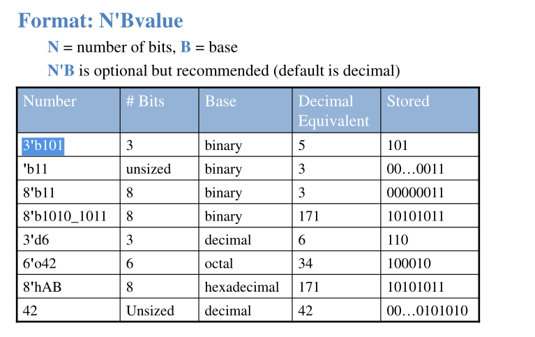


در نوشتن اعداد `_` (unserscore) می‌توان نوشت تا اعداد را خوانا تر نوشت. سیستم وریلاگ آن ها را نادیده میگیرد.


### بازی با بیت‌ها (bit manipulation)


با استفاده از سینتکس `{ }` می‌توان  ترکیب جدیدی از بیت های قبلی ساخت مثلا یک بیت را چند بار در ترکیب جدید تکرار کرد یا چند تا را کنار هم قرار داد.


در مثال بالا می‌توان انواع عملیات را دید. هم انتخاب چند بیت از یک باس بزرگ (a) و هم تکرار یک بیت (b) و هم اضافه کردن تعدادی بیت ثابت 100_010 و همچنین گذاشتن _ برای خوانایی


### خروجیِ سرگردان (Z یا floating output)

در HDLها، نماد Z نمادی برای مقدار floating است. یعنی سیمی که یه ورودی‌ای وصل نیست. مثلا در tri state buffer وقتی enable صفر باشد خروجی Z می‌شود. کد tri state buffer را می‌توان به صورت زیر نوشت:

```verilog
module tristate(input logic [3:0] a,
                input logic en,
				output tri [3:0] y);
		assign y = en ? a : 4'bz;
endmodule


```

در حالتی که enable صفر باشد هیچ مقداری روی خروجی نمی رود و خروجی z می‌شود.


به تعریف تایپِ tri در این ماژول دقت کنید. این مدل، بر خلاف logic می‌تواند چندین مقدار دهنده داشته باشد. درحالی که logic در صورتی که چندین ورودی به آن داده شود x می‌شود. (دقت کنید که حتی tri هم باید در آن واحد یک ورودی بگیرد)


### خروجی نادرست (x یا invalid logic level)

در صورتی که ورودی‌های متصل به یک سیگنال، دو مقدار متفاوت را روی آن قرار دهند (یعنی هم صفر و هم یک) سیگنال مقدار x به خود می‌گیرد که نشانه‌ی خطا در طراحی است. (باگ) در مدار سنتز شده این می‌تواند به صورت رندوم به ۰ یا ۱ تفسیر شود و باعث رفتار‌های undefined شود.

البته در ابتدای شروع مدار، فلیپ فلاپ‌ها (و انواع حافظه‌ها) به صورت x هستند تا زمانی که ریست شوند. این کمک می‌کند که به یاد بیاوریم آن ها را در ابتدا (قبل از اینکه از خروجی‌شان استفاده کنیم) reset کنیم.


اگر یک gate ورودی z بگیرد **ممکن است** در صورتی که خروجی صحیح را نتواند تشخیص دهد، خروجی x تولید کند.


### تاخیر (delay)

مدارهای واقعی تاخیر دارند ولی به صورت خودکار نمی‌توانیم این را در شبیه‌سازی اعمال کنیم. برای همین سیستم وریلاگ امکان تاخیر را برای ما فراهم کرده. (با سینتکس #) این تاخیرها در زمان سنتز نادیده گرفته می شوند و سنتز زمان واقعیِ تاخیر گیت‌ها را قرار می‌دهد نه تاخیر هایی که طراح در کد نوشته.

عددهایی که برای تاخیر جلوی # می‌نویسیم به واحدی هست که در فایل وریلاگ با نوشتن timesscale مشخص کرده‌ایم. معمولا ۱ نانوثانیه در نظر می‌گیریم و پیشفرض هم همین است.


تاخیرها دو کاربرد دارند

+ در زمان شبیه سازی تا تاخیر حدودی مدار به دست بیاید (به شرطی که تاخیر‌های معنی دار گذاشته شود)
+ در زمان دیباگ برای فهمیدن علت و تاثیر ورودی بد مثلا x. اگر همه سیگنال‌ها همزمان با هم تغییر کنند پیدا کردن منبع خطا بسیار سخت می‌شود.


در اینجا برای یک کد ساده، تاخیرها را لحاظ می‌کنیم. فرض میکنیم تاخیر

+ not یک نانوثانیه

+ and سه ورودی ۲ نانوثانیه
+   OR  سه ورودی ۴ نانوثانیه

باشد.

خروجی (y) مقدار ۷ نانوثانیه تاخیر خواهد داشت. (یعنی بعد از تغییر ورودی‌ها ۷ نانوثانیه بعد خروجی مقدار صحیح می‌گیرد) 

در اولین ورودی، y تا زمان مقدار صحیح گرفتن، unknown خواهد بود (با نمایش x در وریلاگ)


```verilog
‘timescale 1ns/1ps library IEEE; 
module example(input logic a, b, c,
					output logic y);
	logic ab, bb, cb, n1, n2, n3;
	assign #1 {ab, bb, cb} = ~{a, b, c};
	assign #2 n1 = ab & bb & cb;
	assign #2 n2 = a & bb & cb;
 	assign #2 n3 = a & bb & c;
	assign #4 y = n1 | n2 | n3;
endmodule


```


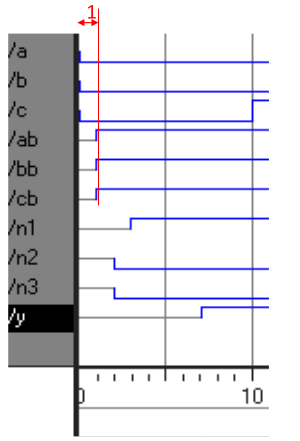


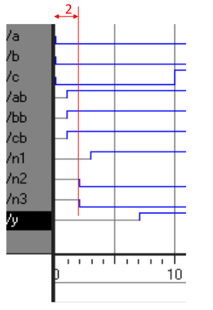


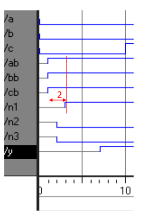


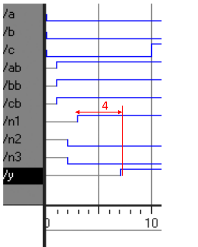


# ۴.۳ مدارهای structural

در قسمت قبل  طراحی رفتاری را دیدیم، توصیف ماژول به کمک ارتباط ورودی و خروجی هایش. در این قسمت مدل structural (ساختاری) را یاد می‌گیریم. توصیف ماژول از روی ماژول‌های ساده‌تری که از روی آن‌ها ساخته شده.

در مثال زیر می‌بینیم چطوری یک ماژول مالتی پلکسر ۴ به ۱ از روی ۳ ماژول مالتی پلکسر ۲ به ۱ ساخته می‌شود.

هر کدام از ماکس‌های ۲ به ۱، یک instance نام دارد.

```verilog
module mux4(input logic [3:0] d0, d1, d2, d3,
			input logic [1:0] s,
			output logic [3:0] y); 
	logic [3:0] low, high;
	mux2 lowmux(d0, d1, s[0], low);
	mux2 highmux(d2, d3, s[0], high);
	mux2 finalmux(low, high, s[1], y);
endmodule
```

۳ تا اینستنس گرفته شده به نام‌های lowmux و highmux و finalmux هستند. خود mux ۲ به ۱ باید جای دیگری توصیف شده باشد.

اینستنس‌های ماژول‌ها باید نام های متفاوتی داشته باشند.


مثال ساخت  nand ۳ ورودی به کمک and و not

```verilog
module and3(input logic a, b, c,
			output logic y);
		assign y = a & b & c;
endmodule

module inv(input logic a,
			output logic y);
	assign y = ~a;
endmodule

module nand3(input logic a, b, c
					output logic y);
	logic n1; // internal signal
    
    and3 andgate(a, b, c, n1); // isntance of and3
    inv inverter(n1, y); // instance of inv
endmodule
```


در این کد، ۲ ماژول and3 و inv به صورت رفتاری پیاده شده‌اند ولی از ترکیب آن‌ها nand3 به شیوه ی structural ساخته شد.


مثال: ساخت ماکس دو به یک ۸ بیتی به کمک ماکس‌های چهار به یک ۴ بیتی

```verilog
module mux2_8(input logic [7:0] d0, d1,
			input logic s,
			output logic [7:0] y);
	mux2 lsbmux(d0[3:0], d1[3:0], s, y[3:0]);
	mux2 msbmux(d0[7:4], d1[7:4], s, y[7:4]);
endmodule
```

در این مثال همچنین bit manipulation را هم تمرین کردیم.


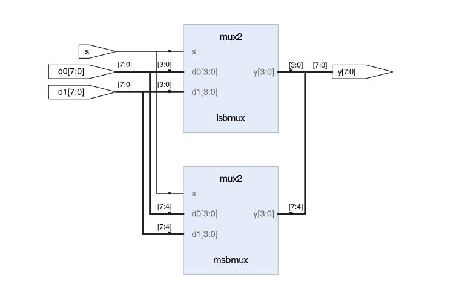

</div>

